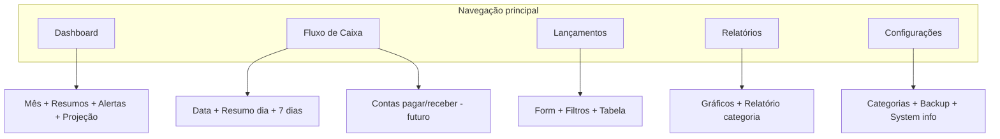

# Plano de Navegação — Desktop e Mobile

**Projeto:** Loja Vida e Saúde — Controle Financeiro  
**Versão:** 1.0  
**Status:** Planejamento (sem implementação)  
**Escopo:** Reorganização da interface em áreas navegáveis, preservando `index.html`, `styles.css` e `app.js` até fases posteriores de implementação.

**Documentos relacionados:**

- `docs/02-regras-negocio-financeiro.md` — regras de cálculo, alertas e fluxo diário.

---

## 1. Problema atual da tela única

Hoje todo o conteúdo vive em um único `<main>` com rolagem vertical contínua. A ordem aproximada no DOM é:

1. Resumo mensal (realizado, previsto, alertas)
2. Cadastro de categoria
3. Formulário de lançamento
4. Backup
5. Projeção de caixa
6. Fluxo por data
7. Próximos 7 dias
8. Gráficos e relatório por categoria
9. Tabela de lançamentos com filtros

### Sintomas para o usuário

| Problema | Impacto |
|--------|---------|
| **Scroll longo** | Dificulta encontrar a ação desejada (cadastrar vs. consultar vs. configurar). |
| **Contextos misturados** | Operação (formulário), análise (dashboard/relatórios) e manutenção (categorias/backup) na mesma página. |
| **Mobile** | Teclado + formulário + tabela larga competem pelo mesmo viewport; filtros e tabela exigem gestos horizontais. |
| **Foco cognitivo** | Quem abre o app para “ver o dia” passa por cadastro e backup antes de chegar ao fluxo de caixa. |
| **Edição distante** | Ao editar um lançamento na tabela, o formulário fica longe no scroll — risco de o usuário não perceber o modo edição. |

### Sintomas técnicos (relevantes para o plano)

- `app.js` referencia elementos por **ID fixo** (`DOM` no topo do arquivo); qualquer remoção ou duplicação de ID quebra a inicialização.
- `renderAll()` atualiza **todas** as áreas de uma vez; esconder visualmente uma seção **não** impede a atualização dos dados (comportamento desejável para navegação por views).
- Alguns blocos pedidos na navegação futura **ainda não existem** no HTML (listas dedicadas “Contas a pagar / a receber”, “Informações do sistema”); o plano prevê encaixe ou criação em fase posterior, alinhado às regras de negócio.

---

## 2. Proposta de navegação desktop

### Padrão recomendado: **barra lateral fixa + área de conteúdo**

```
┌─────────────────────────────────────────────────────────────┐
│  Header: Loja Vida e Saúde                                  │
├──────────────┬──────────────────────────────────────────────┤
│  Dashboard   │                                              │
│  Fluxo Caixa │     [ Painel ativo — uma view por vez ]      │
│  Lançamentos │                                              │
│  Relatórios  │                                              │
│  Configurações│                                             │
└──────────────┴──────────────────────────────────────────────┘
```

### Comportamento

- **Uma view visível** por vez; as demais ficam ocultas com CSS (`display: none` ou classe utilitária), sem remover nós do DOM.
- A view **Dashboard** é a rota inicial após carregar o app (substitui a “página inicial” implícita do scroll).
- **Largura mínima sugerida** para sidebar: 200–240px; conteúdo com `max-width` existente do layout atual.
- **Atalho opcional (fase 2):** teclas numéricas ou links âncora apenas se não conflitarem com inputs; prioridade baixa no MVP de navegação.

### Alternativa aceitável (telas estreitas de desktop / tablet landscape)

Abas horizontais abaixo do header, mesma lógica de views — útil se a sidebar consumir espaço demais em ~1024px. A implementação pode usar **um único componente de navegação** com CSS que alterna entre sidebar (≥ breakpoint) e tabs (< breakpoint).

---

## 3. Proposta de navegação mobile

### Padrão recomendado: **barra inferior (bottom navigation) com 5 itens**

Ícones + rótulo curto (máx. 12–14 caracteres):

| Item | Rótulo sugerido |
|------|-----------------|
| Dashboard | Início |
| Fluxo de Caixa | Caixa |
| Lançamentos | Lançar |
| Relatórios | Relatórios |
| Configurações | Ajustes |

### Comportamento mobile

- Barra **fixa** no rodapé (`position: fixed`), com `padding-bottom` no `<main>` para o conteúdo não ficar atrás da barra.
- **Uma view por vez**, igual ao desktop.
- Na view **Lançamentos**, considerar sublayout em fase 2:
  - Segmento superior: “Novo” (formulário) vs. “Lista” (filtros + tabela), via sub-abas internas — reduz scroll dentro da view mais usada para operação.
- Tabelas largas: manter `report-table-wrapper` com scroll horizontal; não esconder colunas críticas no MVP sem teste com dados reais.

### O que evitar no mobile

- Menu hamburger como **único** meio de troca de área (esconde descoberta das 5 áreas).
- Múltiplas views visíveis simultaneamente (volta ao problema da tela única).

---

## 4. Estrutura de botões ou abas

### Modelo de navegação principal

| Tipo | Elemento | Uso |
|------|----------|-----|
| Container | `<nav id="app-nav" class="app-nav">` | Agrupa itens de área |
| Item | `<button type="button" class="app-nav__item" data-nav="dashboard">` | Evita submit acidental; acessível com `aria-current="page"` no ativo |
| Painel | `<div id="view-dashboard" class="app-view" data-view="dashboard" hidden>` | Envolve o bloco de conteúdo da área |

**Regra:** `data-nav` no botão deve corresponder a `data-view` no painel.

### Mapa área → rótulo → ícone (sugestão semântica)

| `data-view` | Título da área | Ícone (referência) |
|-------------|----------------|--------------------|
| `dashboard` | Dashboard | grade / painel |
| `cashflow` | Fluxo de Caixa | calendário / fluxo |
| `transactions` | Lançamentos | lista + lápis |
| `reports` | Relatórios | gráfico de barras |
| `settings` | Configurações | engrenagem |

### Sub-navegação (opcional, fase 2)

Dentro de **Lançamentos**:

| `data-subview` | Rótulo |
|----------------|--------|
| `transactions-form` | Cadastrar |
| `transactions-list` | Histórico |

Dentro de **Configurações** (scroll interno permitido):

| Bloco | Conteúdo |
|-------|----------|
| Categorias | Formulário “Nova Categoria” |
| Dados | Exportar / importar backup |
| Sistema | Informações do app (versão, storage, link para doc) |

---

## 5. Como esconder e mostrar seções sem quebrar funcionalidades

### Princípio central

> **Mover no DOM, não duplicar. Ocultar com CSS, não destruir nós referenciados por `app.js`.**

### Estratégia recomendada

1. **Envolver** cada grupo de `<section>` existente em um container `.app-view` sem alterar IDs internos.
2. Alternar visibilidade com:
   - atributo HTML `hidden` nos painéis inativos, **ou**
   - classe `.app-view--active` no painel ativo e `.app-view:not(.app-view--active) { display: none; }` em CSS novo (arquivo futuro ou extensão de `styles.css` quando autorizado).
3. Script de navegação **novo e mínimo** (quando implementar): apenas troca de classe/atributo e `aria-current`; **não** reimplementar `renderAll`, formulário ou tabela.
4. Manter **`renderAll()`** chamando todas as funções de render — painéis ocultos continuam recebendo valores atualizados (ex.: alertas no dashboard mesmo com usuário em Lançamentos).

### Fluxos que devem continuar funcionando

| Fluxo | Cuidado |
|-------|---------|
| Editar lançamento | `editTransaction()` preenche o form e dá foco em `#description`; ao implementar navegação, **trocar para a view Lançamentos** (e subview Cadastrar, se existir) antes ou junto do foco. |
| Excluir / salvar | `renderAll()` após salvar; usuário pode estar em qualquer view — dados da view oculta devem estar corretos ao voltar. |
| Alterar mês de análise | Afeta dashboard, gráficos e relatório por categoria; views Relatórios e Dashboard devem refletir sem exigir reload. |
| `localStorage` sync (`storage` event) | Independente da view ativa. |
| Importar backup | Após import, `renderAll()`; considerar mensagem de sucesso visível na view Configurações. |

### O que não fazer

- Remover seções do HTML para “limpar” a tela.
- Renomear IDs usados no objeto `DOM` de `app.js`.
- Carregar `app.js` duas vezes ou lazy-load por view (desnecessário neste MVP).
- Usar `innerHTML` para reconstruir formulário ou tabela na troca de view.

### Detecção de view ativa (implementação futura)

```text
Estado sugerido (sessionStorage opcional):
  chave: financeiro-active-view
  valor: dashboard | cashflow | transactions | reports | settings
Restaurar ao recarregar a página melhora UX, mas não é obrigatório na v1.
```

---

## 6. IDs ou classes sugeridas

### Navegação (novos — não existem hoje)

| Seletor | Propósito |
|---------|-----------|
| `#app-nav` | Container da navegação principal |
| `.app-nav__item` | Botão de cada área |
| `.app-nav__item--active` | Item selecionado (desktop e mobile) |
| `.app-nav--desktop` | Variante sidebar |
| `.app-nav--mobile` | Variante bottom bar |
| `#view-dashboard` | Painel Dashboard |
| `#view-cashflow` | Painel Fluxo de Caixa |
| `#view-transactions` | Painel Lançamentos |
| `#view-reports` | Painel Relatórios |
| `#view-settings` | Painel Configurações |
| `.app-view` | Classe base de painel |
| `.app-view--active` | Painel visível (se não usar só `[hidden]`) |

### Mapeamento: conteúdo atual → área

#### Dashboard (`#view-dashboard`)

| Conteúdo | Seletor / bloco atual |
|----------|------------------------|
| Mês de análise | `#analysis-month`, `#summary-period-label` |
| Resumo Realizado | `#realized-income`, `#realized-expense`, `#realized-balance` |
| Resumo Previsto | `#expected-income`, `#expected-expense`, `#expected-balance` |
| Alertas | `#alert-overdue-expenses-*`, `#alert-upcoming-expenses-*`, `#alert-overdue-income-*` |
| Projeção de caixa | `#projection-today`, `#projection-7-days`, `#projection-15-days`, `#projection-30-days` |

Envolver: `<section class="summary-section">` + seção “Projeção de Caixa” (hoje `section.formulario` com projeção).

#### Fluxo de Caixa (`#view-cashflow`)

| Conteúdo | Seletor / bloco atual |
|----------|------------------------|
| Consulta por data | `#cashflow-date` |
| Resumo do dia | `#selected-date-income`, `#selected-date-expense`, `#selected-date-balance`, `#selected-date-pending-expense` |
| Próximos 7 dias | `#weekly-cashflow-body` |
| Contas a pagar | **Gap:** não há lista dedicada; hoje só agregado “Pendente a pagar” no dia e coluna na tabela semanal. Previsto: bloco `#payables-list` ou tabela filtrada (saídas `pendente`, ordenadas por `dueDate`) — ver `docs/02-regras-negocio-financeiro.md` § fluxo diário. |
| Contas a receber | **Gap:** idem; previsto `#receivables-list` (entradas `pendente`). Regra de negócio já prevê “Pendente a receber” no fluxo diário. |

Envolver: seções “Fluxo de Caixa por Data” e “Próximos 7 Dias”.

#### Lançamentos (`#view-transactions`)

| Conteúdo | Seletor / bloco atual |
|----------|------------------------|
| Formulário | `#transaction-form`, `#form-feedback`, campos `#type` … `#status`, `#submit-button`, `#cancel-edit-button` |
| Filtros | `#filter-category`, `#filter-type`, `#filter-status` |
| Tabela | `#transactions-table-body` |
| Editar / excluir | Botões gerados na tabela (`data-action="edit"`, `data-action="delete"`) — manter delegação em `DOM.transactionsTableBody` |

Envolver: seção “Cadastrar Movimento Financeiro” + `<section class="tabela">`.

**Não** incluir “Nova Categoria” nesta view (vai para Configurações).

#### Relatórios (`#view-reports`)

| Conteúdo | Seletor / bloco atual |
|----------|------------------------|
| Relatório por categoria | `#category-report-body` |
| Gráficos | `#income-expense-chart`, `#expense-category-chart` |
| Entradas x saídas | gráfico `#income-expense-chart` |
| Saídas por categoria | gráfico `#expense-category-chart` |

Envolver: “Resumo Visual do Mês” + “Relatório por Categoria no Mês”.

**Dependência:** relatórios e gráficos usam o mês de `#analysis-month` (controlado no Dashboard). Opções futuras: duplicar seletor de mês na view Relatórios ou exibir aviso “Altere o mês em Início” — na v1, manter um único `#analysis-month` no Dashboard e documentar que Relatórios segue esse valor.

#### Configurações (`#view-settings`)

| Conteúdo | Seletor / bloco atual |
|----------|------------------------|
| Categorias | `#new-category`, `#add-category-button` |
| Exportar backup | `#export-backup-button` |
| Importar backup | `#import-backup-input` |
| Informações do sistema | **Gap:** criar bloco `#system-info` (versão, `localStorage` key, data do último backup exportado opcional) |

Envolver: seções “Nova Categoria” e “Backup dos Dados”.

### Classes existentes a preservar

- `.summary-section`, `.formulario`, `.tabela`, `.filters`, `.charts-grid`, `.report-table-wrapper` — estilos atuais dependem delas; não renomear sem atualizar CSS.

---

## 7. Cuidados para não quebrar o app atual

1. **IDs imutáveis** — O objeto `DOM` em `app.js` lista dezenas de `getElementById`; nenhum ID listado na seção 6 pode mudar ou sumir.
2. **Um elemento por ID** — Não duplicar formulário ou tabelas por view.
3. **Ordem de carregamento** — `init()` → `setDefaults()` → `renderAll()` deve rodar com todos os nós presentes; navegação só após `init` ou no final de `init`.
4. **Formulário no DOM** — Mesmo oculto, inputs participam de `editTransaction` e `handleFormSubmit`.
5. **Event delegation** — Clique em editar/excluir permanece em `#transactions-table-body`; não mover tbody para fora do `main` sem manter o listener.
6. **Classe `.hidden`** — Já usada em `#cancel-edit-button`; reutilizar padrão para views (`hidden` + remover no painel ativo).
7. **Acessibilidade** — `aria-hidden="true"` em views inativas; botão nav com `aria-current="page"`.
8. **CSS atual** — Até autorização explícita, este plano **não** altera `styles.css`; novas regras `.app-nav` / `.app-view` serão adicionadas em momento de implementação.
9. **Git / diffs** — Reorganizar HTML em blocos grandes gera diff ruidoso; preferir “wrap only” (adicionar div pai) em PR dedicado.
10. **Conflito com regras de negócio em andamento** — Se outro PR altera `renderDashboard` ou fluxo semanal, integrar navegação depois que cálculos estiverem estáveis.

---

## 8. Ordem recomendada de implementação

Implementação futura em **PRs pequenos**, sempre com app utilizável entre etapas.

| Fase | Entrega | Arquivos típicos |
|------|---------|------------------|
| **0** | Aprovar este plano + validar gaps (contas a pagar/receber, system info) | `docs/` |
| **1** | HTML: wrappers `.app-view` + `#app-nav` sem JS de troca (tudo visível ou só dashboard visível via CSS temporário) | `index.html` |
| **2** | CSS: layout desktop sidebar + mobile bottom bar + painéis ocultos | `styles.css` |
| **3** | JS mínimo: `switchView(name)`, persistência opcional, ir para Lançamentos ao editar | `app.js` (pequeno bloco) ou `nav.js` importado após `app.js` |
| **4** | UX: sub-abas em Lançamentos (form vs lista) | `index.html` + CSS |
| **5** | Fluxo de Caixa: listas Contas a pagar / a receber conforme regras de negócio | `index.html` + funções de render em `app.js` |
| **6** | Configurações: bloco Informações do sistema | `index.html` |
| **7** | Polimento: animações leves, foco, testes mobile reais | CSS + ajustes pontuais |

**Critério de “pronto” por fase:** `renderAll()`, cadastro, edição, exclusão, backup e filtros passam nos testes manuais da seção 9.

---

## 9. Testes manuais necessários

### Navegação geral

- [ ] Ao abrir o app, a view inicial é Dashboard (resumo + projeção visíveis).
- [ ] Cada item da nav exibe somente seu painel; demais painéis não são focáveis (`Tab` não entra em campos ocultos).
- [ ] Recarregar a página mantém view padrão (ou última view, se sessionStorage implementado).
- [ ] Redimensionar janela desktop ↔ mobile: nav muda de sidebar para bottom sem perder view ativa.

### Dashboard

- [ ] Alterar “Mês de análise” atualiza realizados, previstos, alertas e projeções.
- [ ] Valores de alertas batem com lançamentos de teste (vencido, a vencer, a receber atrasado).

### Fluxo de Caixa

- [ ] Alterar “Data para consulta” atualiza resumo do dia.
- [ ] Tabela “Próximos 7 dias” coerente com vencimentos de teste.
- [ ] (Após fase 5) Listas contas a pagar/receber filtram só pendentes.

### Lançamentos

- [ ] Cadastrar entrada e saída com validação de valor (`3.000,00` etc.).
- [ ] Filtros por categoria, tipo e status reduzem linhas corretamente.
- [ ] Editar: view vai para Lançamentos (quando JS fase 3), formulário em modo edição, cancelar restaura.
- [ ] Excluir: confirma, remove linha, `renderAll` atualiza dashboard em background.

### Relatórios

- [ ] Gráficos e tabela por categoria refletem o mês selecionado no Dashboard.
- [ ] Sem lançamentos no mês: mensagens / gráficos vazios sem erro no console.

### Configurações

- [ ] Adicionar categoria reflete nos selects do formulário e filtros.
- [ ] Exportar JSON válido; importar substitui dados e atualiza todas as views.
- [ ] (Após fase 6) Informações do sistema exibem dados coerentes.

### Regressão técnica

- [ ] Console sem erros em troca de views e após import backup.
- [ ] Duas abas abertas: evento `storage` sincroniza (se ainda suportado).

---

## 10. Riscos de fazer junto com outras alterações

| Risco | Descrição | Mitigação |
|-------|-----------|-----------|
| **Refator grande de `app.js`** | Módulos, rename de funções ou mudança em `renderAll` no mesmo PR que navegação. | PR separado; navegação só chama `switchView`. |
| **Mudança de regras de negócio** | Novos campos em alertas, fluxo semanal ou projeção enquanto o HTML é reorganizado. | Congelar estrutura de views; alterar só conteúdo interno das seções. |
| **Redesign visual completo** | Troca de paleta, grid e breakpoints junto com nav. | CSS em PR próprio após HTML wrappers estável. |
| **Supabase / API** | Backend novo + rearranjo de DOM. | Navegação primeiro em localStorage; API depois. |
| **Diff monolítico em `index.html`** | Conflitos de merge difíceis de resolver. | Commits “wrap only”; evitar reformatar indentação de todo o arquivo. |
| **Duplicar seletor de mês** | Dois `#analysis-month` quebram `getElementById`. | Um único controle ou IDs distintos com sync explícito no JS. |
| **Ocultar com `visibility` errado** | `visibility: hidden` ainda permite foco em alguns casos. | Preferir `hidden` ou `display: none` nos painéis inativos. |
| **Remover seção “de teste”** | Apagar backup ou categorias achando que “não cabem” na nav. | Mover para Configurações, nunca remover funcionalidade. |

---

## Resumo visual do agrupamento



---

## Checklist de aceite do documento

- [x] Problema da tela única descrito
- [x] Navegação desktop e mobile propostas
- [x] Estrutura de abas/botões definida
- [x] Estratégia de ocultar/mostrar sem quebrar `app.js`
- [x] IDs/classes sugeridas com mapeamento do HTML atual
- [x] Cuidados e ordem de implementação
- [x] Testes manuais e riscos documentados

---

*Documento de planejamento — nenhum código de produção alterado na criação deste arquivo.*
